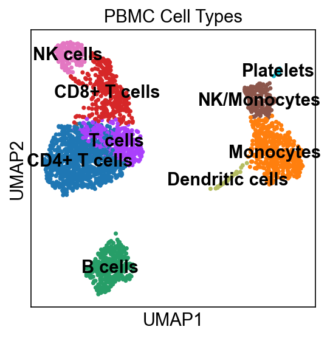

# scanpy-scrna-pbmc-tutorial
# PBMC 3k scRNA-seq Analysis

Walking through a standard scRNA-seq pipeline using the 10x Genomics PBMC 3k 
dataset — 2,700 peripheral blood mononuclear cells from a healthy donor.

## Pipeline
- Quality control and filtering
- Normalization and log transformation
- Highly variable gene selection
- PCA and dimensionality reduction
- Leiden clustering
- Cell type annotation

## Results
9 cell populations identified including CD4+ T cells, CD8+ T cells, 
B cells, NK cells, monocytes, dendritic cells, and platelets.



## Setup
```bash
conda env create -f environment.yml
conda activate scrna
jupyter notebook
```

## Tools
- Python 3.10
- Scanpy 1.11.5